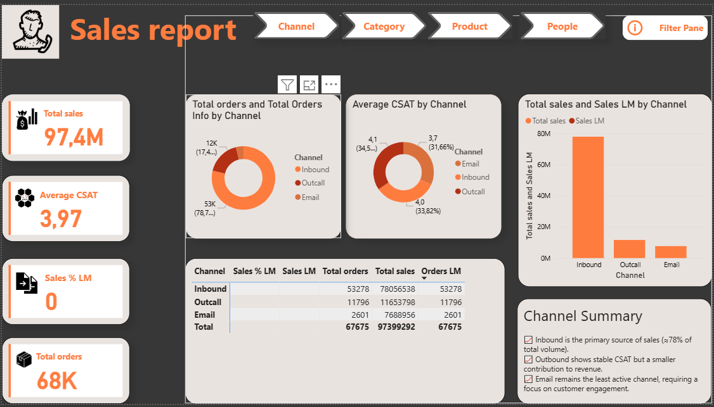
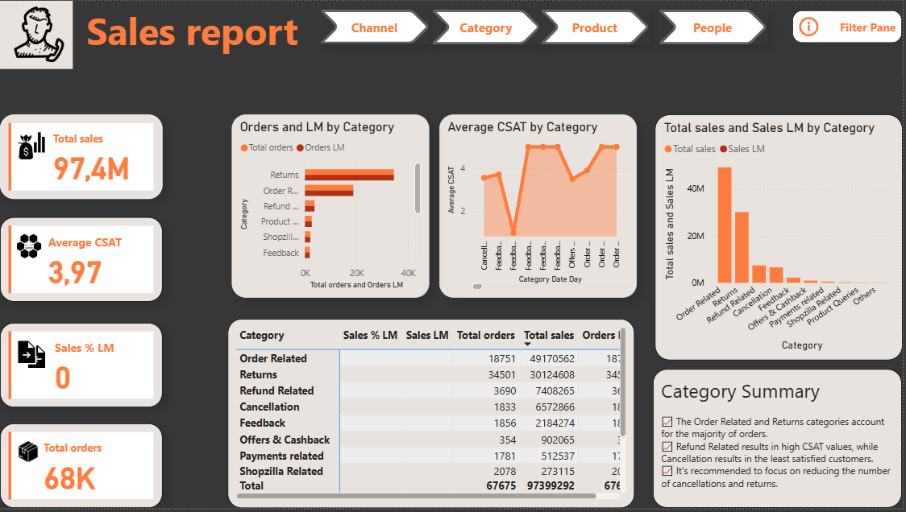
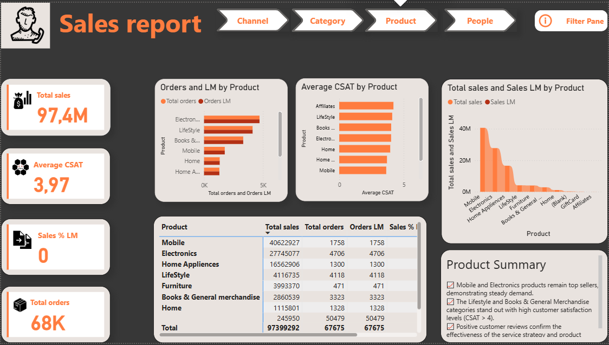
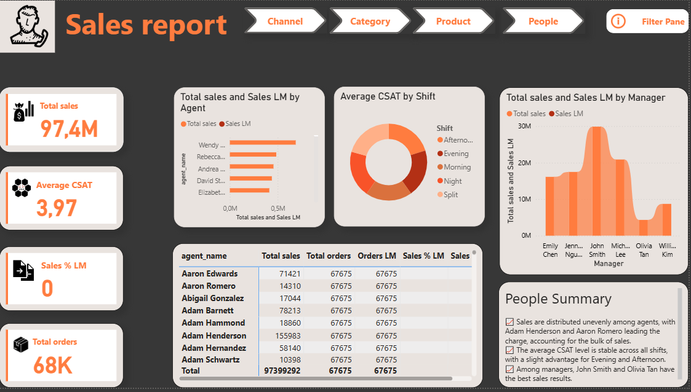

#  Customer Service & Sales Dashboard (Power BI)

### 📊 Overview
This Power BI report analyzes **sales performance, customer satisfaction (CSAT), and order behavior** across multiple perspectives — by channel, category, product, and people.  
It provides management insights into revenue trends, service quality, and operational efficiency using a consistent orange-black theme.

The dashboard is fully interactive and designed for call-center where both sales and customer experience metrics matter.

---

## 📘 Full List of DAX Measures
You can view all DAX calculations used in this dashboard — including KPIs, time intelligence, and % change measures — in a separate file below:

👉 [View DAX_Measures.md](DAX_Measures.md)
---

## 🧱 Report Pages

### 📞 1. Channel Overview

- Shows total **orders, sales, and average CSAT** across communication channels (Inbound, Outcall, Email).  
- **Inbound** channel generates ~78% of all sales.  
- Outcall and Email maintain similar satisfaction levels but lower sales share.  
- Channel Summary card highlights improvement priorities.

---

### 🛒 2. Category Performance

- Analyzes orders, sales, and CSAT by product or service category.  
- Visuals:  
  - Orders and LM by Category  
  - Average CSAT by Category  
  - Total Sales and Sales LM  
- Summary explains category strengths and weak points (e.g., high refunds, cancellations).  

---

### 📦 3. Product Analytics

- Product-level breakdown of sales, orders, and satisfaction.  
- **Top performers:** Mobile and Electronics — highest sales volume.  
- **High satisfaction:** Lifestyle and Books categories (average CSAT > 4).  
- Product Summary includes actionable notes for management.

---

### 👥 4. People Performance

- Focus on **agents, managers, and work shifts.**  
- Shows distribution of sales, CSAT, and total orders per agent and manager.  
- Visuals:
  - Sales by Agent  
  - Average CSAT by Shift  
  - Sales by Manager  
- People Summary provides quick team insights — who sells best, who maintains service quality.

---

### 🎛 5. Filter Pane

- Dedicated interactive filter page.  
- Allows users to slice results by **Month**, **Shift**, or any other dimension.  
- Navigation button returns to main dashboards.  

---

## ⚙️ Key Features
- Interactive Power BI dashboard with multiple views.  
- KPI cards: **Total Sales**, **Average CSAT**, **Sales % LM**, **Total Orders**.  
- Navigation buttons with page highlights (Channel → Category → Product → People).  
- Consistent design theme: dark background + orange highlights.  
- DAX-based KPIs for sales, CSAT, and last-month comparisons.  
- Dynamic summaries with business recommendations per page.

---

## 🧩 Data Model
- **Fact tables:** Sales, Orders, Customer Feedback.  
- **Dimensions:** Channel, Category, Product, Agent, Manager, Calendar.  
- Relationships are one-to-many (*1:*) with single-direction filtering for clean context.  

---

